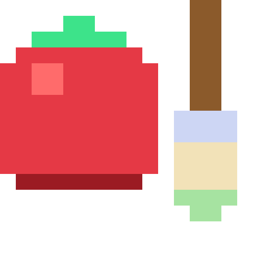

# Pixel Pomo Art Kit



A desktop pixel-art editor (Windows and macOS) for drawing and editing the
sprites that grow in Pixel Pomo's garden — flowers and the surrounding forest.
It is not a general-purpose pixel editor:
the document format, the palette, and the render path are all borrowed
directly from the game's own sprite generator (`gen_objects.py`), so a flower
drawn or edited here comes back out **byte-for-byte identical** to the PNG the
game actually ships — because the live preview and every export all run the
game's own compositing code, not a reimplementation of it.

## Running it

**Just want to draw?** Grab the build for your machine from the latest
[Release](../../releases/latest) — no Python needed either way, and both carry
their own copy of the sprite generator, so they work with no game checkout at
all. Each keeps its `library/` and `exports/` folders next to itself.

| | file | notes |
|---|---|---|
| **Windows** | `PixelPomoArtKit-windows.zip` | unsigned, so SmartScreen says "Windows protected your PC": **More info → Run anyway**. Drawings live in `%LOCALAPPDATA%\PixelPomoArtKit\` — the .exe can sit anywhere and be moved or replaced freely (#v2.5.0). |
| **macOS, Apple Silicon** | `PixelPomoArtKit-macos-apple-silicon.zip` | M1/M2/M3/M4 — any Mac from late 2020 on |
| **macOS, Intel** | `PixelPomoArtKit-macos-intel.zip` | older Intel Macs |

All three are built by CI from the same commit, so the platforms never drift
apart. Each zip carries its own step-by-step guide inside
(`READ-ME-FIRST.txt` / `READ-ME-FIRST-MAC.txt`).

### Where your drawings are, and why updates cannot lose them

**The data never lives next to the program.** A program is the thing that gets
moved, re-downloaded, replaced and deleted; the drawings have to survive all of
that, so they are kept in a per-user folder the program only points at:

| | drawings, exports, settings, update backups |
|---|---|
| Windows | `%LOCALAPPDATA%\PixelPomoArtKit\` (e.g. `C:\Users\you\AppData\Local\PixelPomoArtKit\`) |
| macOS | `~/Documents/PixelPomoArtKit/` |

GUIDE shows the folder and has an **OPEN FOLDER** button. Up to v2.4.0 the
Windows build wrote beside the .exe; the first run of v2.5.0 finds that old
`library/` and copies (never moves) its drawings over, then tells you.

**UPDATE** (next to GUIDE) asks GitHub for the latest release. A newer one turns
the button into `UPDATE ● vX.Y.Z` (a fresh build also checks once, quietly, on
start). On **Windows** the kit downloads the new .exe, **zips the library to
`backups/library-before-<version>-<date>.zip` first**, closes, swaps itself and
reopens; the previous .exe is kept as `PixelPomoArtKit.old.exe` in case you want
it back. On **macOS** it opens the download page — replace the .app as in the
setup steps; your drawings are in Documents and untouched.

**JSON vs PNG.** The library is JSON (`library/*.json`). That is the editable
drawing and it is what survives an update. **Export engine sprite** writes the
PNG the garden actually loads. **Export SVG** is the share format — vector
rects, so zooming in Illustrator or a chat preview does not pixelate. **Export
JSON** sends a drawing to another kit.

### macOS, step by step

**Pick the right download first.**  → *About This Mac*: "Chip: Apple M…" wants
the apple-silicon zip, "Processor: Intel…" wants the intel one. The wrong one
fails to open with an unhelpful error, and nothing in the app itself can warn
you — PyInstaller cannot cross-compile between architectures, so these are two
genuinely different binaries.

1. **Unzip** the one you downloaded.

2. **Drag `PixelPomoArtKit.app` into your Applications folder.** Don't skip
   this. macOS runs unsigned apps launched from `Downloads` out of a randomised
   read-only copy (*app translocation*), and the app misbehaves from there.

3. **First launch only** — the app is unsigned, so macOS blocks it. Which route
   you need depends on the macOS version:

   - **macOS 15 (Sequoia), macOS 26 (Tahoe) and newer** — Apple removed the
     right-click shortcut, so it will not help. Double-click once, click
     **Done** on the warning, then  → **System Settings** → **Privacy &
     Security** → scroll to **Security** → *"PixelPomoArtKit.app was
     blocked…"* → **Open Anyway** → confirm → **Open**.
   - **macOS 14 (Sonoma) and older** — **right-click** the app → **Open** →
     **Open** again. Plain double-clicking does not offer this choice.
   - **Last resort**, any version, in Terminal:
     ```
     xattr -dr com.apple.quarantine /Applications/PixelPomoArtKit.app
     ```

   After this, it opens by double-click like anything else.

4. **Your drawings live in `~/Documents/PixelPomoArtKit/`** — `library/` for the
   drawings, `exports/` for exported sprites, `settings.json` for favourites
   and the last tool used.

   Deliberately *not* beside the app, unlike Windows. `sys.executable` inside a
   `.app` points at `Contents/MacOS/`, so "next to the executable" would hide
   every drawing inside the bundle — and dragging a new version over the old app
   would delete all of them without warning. Documents is visible, stable, and
   survives replacing the app.

5. **If macOS asks whether the app may access Documents, click Allow.** If it
   was refused (or the prompt never came), the kit says so on launch and keeps
   the drawings in `~/Library/Application Support/PixelPomoArtKit/` instead —
   it never runs with saves silently failing (#v2.4.0). To move back:
   System Settings → Privacy & Security → Files and Folders → allow Documents
   for PixelPomoArtKit, then restart it. A failed save also shows **SAVE
   FAILED** in the status label next to SAVE, and once as a dialog.

To run from source instead, from the repository root:

```
python -m art_kit
```

Requirements:
- Python 3 with `tkinter` (part of the standard Windows installer).
- [Pillow](https://pypi.org/project/Pillow/) (`pip install Pillow`) — needed
  for `Export JPG…` and by a couple of tests that inspect PNG/JPG output.
  Plain PNG and engine-sprite export don't need it: the generator writes PNG
  bytes itself, standard library only.
- A checkout of the Pixel Pomo game containing `flutter/tools/gen_objects.py`.
  It is found **relative to this folder** — the game is expected at `..\App`,
  i.e. both checkouts sitting side by side under one `Pixel Pomo` folder — so
  moving or renaming that folder does not break it. Point the
  `PIXEL_POMO_TOOLS` environment variable at a `tools` folder to override that
  for a layout that isn't this one.

On first run the app creates a `library/` folder (next to `art_kit/` when run
from source; see the table above for the builds) and seeds
it with everything the game ships, read live from `gen_objects.py` — not copied
in: the **24 flowers** (12 species, 2 hand-authored models each), the five
**Drawing Patch 1** houseplants Ola Górecka drew (anthurium, pilea ×2, sundew ×2 — read
from the PNGs the game ships, since they are not generator output, and signed
with her name as their artist), and the whole
**forest** — 20 trees, 10 bushes, 5 rocks (#v34.8). Four designs also come with
the kit itself (v2.9.0, `art_kit/seeds/`): HeroDev999's **Space Eyes** 208×208
and 13×13, and LadyOfDynamite's **Border** and **Ghostie**. They are added once,
to a new library and to an existing one alike; one you delete stays deleted.

Forest props are raw pixel art: no letter palette, no automatic rim, so what you
paint is exactly what the garden draws. A tree's canvas size *is* its size in the
garden — 16px per tile, so a 2/3/4-tile tree is a 32/48/64-cell grid — and
exporting one at the wrong size is refused rather than written at a pixel density
that would not match the rest of the scene. Every drawing
is one JSON file in `library/`: plain, readable text, safe to open, diff, or
hand-edit if the app ever writes something wrong. The first time a session
touches a drawing, the file it started from is kept as `<name>.json.bak` —
undo history dies with the window, but "how it looked when I opened the app
today" survives next to it.

## The window

Three panes, left to right, in the game's **matcha** theme (the tones are
`PixelTheme.matcha` from the app itself, so the kit and the game look like one
product — dark title bar on Windows included):

- **Library.** `▶ ALL · 59` at the top is **one checklist** of every label
  and, under **ARTISTS**, every artist (each in their colour), "no label" and
  "no artist" included; its arrow points at the words and turns down while the
  list is open. What is ticked is what is listed: a drawing shows if its label
  **or** its artist is ticked, so Hero, then OTHER, is Hero's drawings and
  every OTHER one besides. Under ALL every row is ticked; from there a click
  ticks just that row, and each click after it ticks one on or off (the list
  stays open while you tick); nothing ticked, or ALL, lists everything. The
  rows always stay in the library's order. Below, one row
  per drawing: a small thumbnail (rendered the same way the canvas is), the
  name, the label chip (click it to change the label — the shipped drawings
  start as `flower` / `tree` / `bush` / `rock`, imports as `import`, and you
  can type anything — and a `⋮` beside each name in the label dialog renames that
  label, or takes it off, on every drawing at once), the **artist's initial** in that artist's own colour
  (the artist dialog has the same `⋮` for each artist, their colour following a rename) —
  a layer of its own beside the label, picked at random for each new artist and
  kept, so two artists who share a letter still differ — and a `⋮` menu — Duplicate, Export PNG…, Export PNG
  with grid…, Export JPG…, Export engine sprite…, Rename…, Label…, Artist…,
  Size…, Delete. Clicking a row opens it in the canvas. Every menu and message box
  in the kit is drawn in its own matcha colours (arrow keys and Enter work in
  the menus too); the one window that stays Windows' own is the file picker
  behind IMPORT and the exports.
  `+ NEW DRAWING` (or `Ctrl+N`) opens a **size dialog**: the sizes the garden
  actually uses — Flower 16×15, Bush and Rock 16×16, Tree 32/48/64 for 2/3/4
  tiles, all read from the engine, not typed in — or **any** custom width ×
  height (there is no 64-cell cap any more; past 512 × 512 the dialog asks
  first, because every stroke re-renders and saves the whole grid and a
  drawing that big is slower, and more than 4096 a side is refused as the typo
  it is). **IMPORT PNG…** below it brings outside art in (Procreate, Aseprite,
  anything): colour profile converted to sRGB, anti-aliasing snapped, x16
  exports scaled back down — several files at once, each **saved into the
  library immediately**, with a summary of what was changed or refused.
- **Canvas.** The grid fills the middle: selecting a drawing auto-zooms it
  to fit the pane. Click or drag to paint with the current tool and ink —
  fast drags are interpolated, so a quick stroke is a continuous line, not a
  trail of dots, and **what you paint is exactly what appears**: one click,
  one square. **Right-click is an eyedropper**: the cell under the cursor
  becomes the ink. The mouse wheel (or `+`/`-`) zooms about the pointer, up
  to 1024 px a cell and down to 1x — or, for a drawing too big for the
  corner's 1x box, down to that box's own 1/n x (1/10 px a cell for a
  600-wide drawing), where every screen pixel is the average of the cells it
  covers. Scrollbars keep the edge pixels reachable at any zoom — and dragging
  against the edge of what you can see scrolls that way, one cell at a time;
  `Space`+drag or the middle button pans. **The strip over the canvas** is the
  camera: FIT (which holds: fold the library away or resize the window and the
  drawing is fitted again, until you zoom or pan yourself), FREE, the corner /
  side / centre arrows, and **LOCK**, which
  freezes the view exactly as it is framed — zoom *and* position. Under LOCK
  the wheel, `+`/`-`, FIT and panning do nothing (the corner says *camera
  locked*); each drawing keeps its own frozen view until another mode is
  picked. **Drag an edge or a corner** of the drawing to add or take away
  rows and columns on that side — the grab lies just outside the edge, only a
  sliver inside it, so painting the border cells never turns into a resize;
  empty cells show a checkerboard of 2 × 2-cell squares in your two grid
  colours (never smaller than 4 px on screen, so zoomed far out the squares
  grow rather than blur); cell lines appear
  once each cell is 8px or larger (WITH / WITHOUT GRID turns them off). A
  one-pixel line runs the full height between the canvas and the tools.
  **Under the canvas:** `total N · empty N · pixels N` plus the count in the row and column under
  the cursor (or in the selection), the drawing's colours left to right —
  most-used first, with code and count, click one to use it — and the cell
  and colour under the cursor.
- **Tools**, top to bottom:
  - **SAVE**, with a `saved HH:MM:SS` status beside it. Every stroke is
    autosaved the moment it ends anyway; SAVE (or `Ctrl+S`) is the artist's
    reassurance, and the one save that complains out loud if it fails.
  - **DRAW / ERASE / FILL / SELECT** — the selected tool is the accent-filled
    button, and the last tool you used is the one selected next time you open
    the kit. **UNDO / REDO.** **Eraser W × H** sets how many cells the eraser
    clears at once, centred on the pointer (a ghost shows the footprint).
  - **SELECT** (`s`): drag a rectangle. `Ctrl+C` copies it, `Ctrl+X` cuts,
    `Delete` clears. `Ctrl+V` drops the copy as a **floating block** you can
    drag with the mouse or nudge with the arrow keys; `Enter` (or a click
    outside) stamps it down as one undo step and leaves it selected. Press
    inside a selection and drag to **move** that part of the drawing. `Esc`
    never destroys anything: it drops a floating block where it is, then
    clears the selection.
  - **Grid** — `colour 1` / `colour 2`, the two checkerboard tones behind the
    art, each name right beside its `…`: type a code and Enter, or `…` for the
    kit's own colour picker — the grid follows it live while it is open,
    CANCEL puts it back and OK is one undo step. DEFAULT restores the matcha
    tones; **WHITE** and **BLACK** (stacked between DEFAULT and the fields)
    make both tones white or both black, a plain ground to judge the art on,
    with the cell lines turned darker or lighter to stay visible. Every row
    of the tools pane is as wide as the colour grids, with even margins.
  - **The ink**, shown as its bare `#rrggbb` code on a swatch of itself.
    Click it and type a new code (Enter applies, Esc cancels); double-click
    selects the whole code to copy; `+` adds it to your favourites.
  - **Favourite colours** — starts as six classic colours; `+` adds the ink,
    right-click a swatch to remove it. Kept in `settings.json`.
  - **Ready colours** — thirty of Pixel Pomo's theme tones and pixel-art
    staples.
  - **Colour** — the full colour panel, embedded the way a phone app does
    it: a hue strip over a shade square, click or drag. Exactly as wide as
    the swatch grids above it, edge to edge.
  - **Symmetry** — three modes (`m` cycles them), a direction `│ 90°` /
    `─ 180°`, and a length. Each drawing keeps its own: the line stays with
    the drawing it was placed on and comes back with it, a drawing never
    given one opens with symmetry OFF, and a line the drawing shrank away
    from is taken off rather than left outside the art:
    - **OFF** — plain painting.
    - **MIRROR** — a bar stands on the canvas, `length` cells long, centred
      where you click; a ghost follows the cursor until you do. Anything
      painted along the bar is mirrored across it; cells beyond its ends are
      painted alone, so a bar over one petal does not ghost the stem. The
      stroke and its mirror are one undo. **Press on the bar and drag to move
      it** (the cursor becomes a move cross over it), or **PLACE BAR** and
      click a new spot. The bar is drawn as an outline only — it is one cell
      wide. **Drag either end of the bar** to change its length on the canvas.
    - **REVERSE** (v2.9.0, in STICK's place) — the SELECT rectangle,
      turned over and copied beside itself. The button glows once something
      is selected. Its panel: the **axis** it is turned over across (**X**
      upside down, **Y** left ↔ right, **X+Y** half round), **eight arrows**
      for the side the copy goes to, and on their right the **distance** —
      **EQUAL**, one number of empty cells between the two (15 toward the
      lower left is 15 across *and* 15 down; 0 is right beside it), or
      **X · Y**, the two apart ("right 5, up 2"). A dashed blue outline on the
      canvas shows where the copy will land, under the cell lines like the
      art; **COPY REVERSED**, `R` or `Enter` writes it as one undo step, and
      the original stays selected for the next arrow. The square in the
      middle of the arrows (or the pressed arrow again) takes the direction
      away. Moving or dropping the selection lets go of REVERSE, and so does
      pressing it again.
    - Each mode shows its own panel under the mode row; **OFF** shows none.
  - **Under the colour square** (v2.9.0) — the ink NOW over the colour it
    replaced (WAS: click it to go back), and the ink as H S B and R G B, each
    typed into with Enter. A ring marks the ink on the square and a tick its
    hue on the strip.
  - **SWAP** (v2.9.0, the fifth tool) — click a pixel and every pixel of
    that colour becomes the ink, as one undo step; a palette letter and a raw
    colour that look the same count as one colour. With a SELECT rectangle
    made first it keeps inside it. Hovering outlines what it would change.
  - **WITH GRID / WITHOUT GRID / VIEW ONLY** — three equal buttons, one
    pressed: the cell lines over the drawing, or none, or **VIEW ONLY** (was
    LOOK) — the canvas shows the drawing as it looks (no checkerboard, no
    cell lines, no symmetry line) and nothing is drawn, erased or resized on
    it until VIEW ONLY or a GRID button is pressed again; zoom, pan and the
    eyedropper still work.
  - **Rulers** (v2.9.0) — x1, x2 … over the canvas and y1, y2 … down its
    left, like a spreadsheet's headings — every cell its own box and label,
    the type shrinking as the zoom goes out. The selection is shaded on them and the cell under the
    pointer lit. Press **x1** to select all of column x1, **y1** all of row
    y1, drag along a ruler for several; the corner box selects the whole
    drawing. **COORDS**, in the bottom-right corner beside the cell and
    colour readout, shows or hides them. Cells are counted from 1 everywhere
    the kit shows a number.
  - **Bottom-right corner:** the two live previews — **1x** actual size and a
    fixed **squint**-test scale, both rendered through the same engine code
    as every export. Then the drawing's **W × H** (click it
    to resize; one undo step), **UPDATE** (see above), and **GUIDE** (was
    HELP), which lays every button and key over the window, ends with how
    your work is protected, names the folder your drawings are in, and closes
    with `×`, `Esc` or `F1`.

Keyboard: `Ctrl+S` save, `Ctrl+Z` undo, `Ctrl+Y` / `Ctrl+Shift+Z` redo,
`Ctrl+N` new drawing, `Ctrl+C` / `Ctrl+X` / `Ctrl+V` copy / cut / paste the
selection, `Enter` drop a floating block (under REVERSE: copy the selection
reversed), `Delete` clear the selection, arrow
keys nudge the block, `b` / `e` / `f` / `s` / `c` draw/erase/fill/select/swap, `m`
symmetry OFF → MIRROR → REVERSE, `r` copy reversed (under REVERSE), `+` / `-` zoom, `F1` help, and — in the TEST
build only — `F12`, a snapshot (the window as it is, plus the zoom, pane,
camera and drawing behind it, saved as `snapshots/snap-<time>.png` and `.json`
in the data folder, for showing what went wrong; click the “snapshot” message in the top-right corner to see the file in Explorer). Every heading, menu, dialog
and message follows LANGUAGE — English, Türkçe, Polski, Deutsch — except the
GUIDE's own rows, which are still English — its last part, how your work is
protected, follows the language too. Every dialog opens where it belongs,
rather than in the screen's top-left corner first. On macOS `Cmd` works everywhere `Ctrl` does, and
right-click is also Control-click. The title bar always names the drawing you
are editing.

Closing the window (or Cmd+Q) finishes any stroke in progress and writes every
drawing touched in the session before quitting.

## Exports, and which one to hand back to the developer

| Export | What it produces | Use it for |
|---|---|---|
| **Export PNG…** | An RGBA PNG at 16x (the export dialog just asks where to save it; `export_png`/`export_jpg` underneath both take a `scale` argument if you're driving them from a script instead of the window). | Sharing a look, a reference — anything that isn't shipping straight into the game. |
| **Export PNG with grid…** | The same, with a one-pixel line on every cell boundary, the outer border closed on all four sides. | Work in progress where the cells have to be countable. |
| **Export JPG…** | The same render flattened onto white (JPEG has no alpha channel, so transparency has to become some solid colour — the underlying `export_jpg` takes the background as an explicit argument, the window just always calls it with the white default today). | Quick previews outside the game; never for shipping, since the transparency is gone. |
| **Export engine sprite…** | The x16 engine-scale RGBA sprite of **any** drawing at **any** size, to a file **you name** in one ordinary save dialog (the default name is the engine's own — `flower_lale_1.png`, `tree_07.png` — for a shipped species or prop, else a slug of the drawing's name). Replacing an existing file is the system's own question; there is no second confirmation and no 16-wide refusal any more (#v2.6.0). The dialog opens on the kit's `exports/` folder — never the game's asset tree. | **Hand this back to the developer**, who sizes and names it for the garden if it isn't already. The strict, engine-checked writer (`export_engine_sprite`: engine names, engine sizes, refusals) still exists in code for that step. |

### The artist's mark on exports

Nothing can stop a picture on a screen from being copied, so the kit does not
pretend to. What it does is make the artist's name travel with the file, make
removing it a deliberate act, and keep the proof of who made what, and when.
The export dialog asks, under the background question:

- **Signature** — the name *on* the picture, two switches that go on and off
  independently, so either, neither or both: **CORNER** ("© 2026 MIR" small in
  the bottom-right corner, in the kit's own pixel letters, light with a dark
  rim so it reads on any background) and **WATERMARK** (the same, faint and
  repeated across the whole picture — a proof to share; with both, the corner
  lies on top). It is drawn into the file's own pixels, so a screenshot keeps
  it, and the preview shows it.
  A drawing with no artist cannot be signed (`⋮ → Artist…` first); a picture
  too small for the letters is left unsigned and says so; a long name steps
  down to a shorter form (no year, first name, initials).
- **☑ Name and © inside the file** (on by default) — PNG text chunks
  (Title, Author, Copyright, Description, Software, Creation Time) plus XMP;
  JPEG EXIF (Artist, Copyright, ImageDescription and the XPAuthor/XPTitle
  Windows' Properties window shows, with the name exactly as written) plus XMP
  and a comment; SVG `<title>`, `<desc>` and Dublin Core metadata. Social
  networks strip this; files sent directly, or downloaded, keep it.
- **☑ Write every export down in export-log.jsonl** (on by default) — see
  below; the artist's to turn off.

Whatever is chosen, every image export says what made it: *Pixel Pomo Art Kit*
as the Software (Explorer's **Program name**) and *Made with Pixel Pomo Art
Kit* as the comment (an SVG opens with it as an XML comment).

And every export — PNG, SVG, JPG, JSON, engine sprite — is written down in
**`export-log.jsonl`** in the data folder: the time, the file and its
SHA-256, the drawing, its size and artist, the SHA-256 of the drawing's own
file, how it was signed, and an export id that the file's XMP carries too.
Each line holds the SHA-256 of the line before it, so a line edited or removed
afterwards breaks the chain from there on (`provenance.verify`).

The engine sprite stays clean — no signature, no text chunks: it is the game's
build input, compared pixel for pixel with what the generator makes.
## Sending a drawing back (for the artist)

Two easy ways, pick either:

- **The lossless one (best):** send the drawing's `.json` file from the
  `library\` folder (GUIDE → OPEN FOLDER) — it is the drawing itself, nothing
  lost.
- **The visual one:** `⋮ → Export PNG…` (or `Export engine sprite…` for the
  x16 file, named as you like) and send that.

Everything else — species ids, palettes, letter grids, engine source entries,
the exact size and filename the garden wants — is the developer's problem, on
purpose: **you draw with real colours, one click one square, label it, and
send it; the developer converts it for the engine behind the scenes.**

## Developer notes: letters and palettes (not the artist's job)

The engine stores each flower as a letter grid (`_FLOWER_BLOOMS`) plus five
tones (`_FLOWER_PALS`). The 24 imported flowers arrive in that form and
render with the engine's automatic rims — which is also why they must keep
looking exactly as shipped. Anything the artist paints is a raw colour on
top; raw cells render as-is, with no rim magic (the rose already ships
exactly this way, byte-identically).

Converting a finished raw drawing into engine source, when wanted, happens
in code, not in the artist's window: `engine_io.export_grid_literal()` and
`engine_io.export_palette_literal()` produce the two paste-ready lines for a
letter drawing, and `store.load()` gives you the raw cells to map onto
letters first. Engine sprites are always 16 cells wide — `Export engine
sprite…` checks that before writing anything.

## The icon

Pixel Pomo's tomato with a brush beside it, a 16×16 letter grid in
`art_kit/branding.py` — the same way the game keeps its own sprites. The window
draws it at run time (title bar, Dock); `python -m art_kit.branding` renders
`assets/icon.png`, `icon.ico` (the .exe) and `icon.icns` (the .app) from the
same grid, and both release zips carry `icon.png`.

## Trying a version before releasing it

`TestPixelPomoArtKit.exe` is the pre-release channel: the build that runs code
which has not been pushed or released yet, so a version can be lived with
before it becomes the download everyone else gets.

```powershell
.\build_test.ps1          # -> dist\TestPixelPomoArtKit.exe
```

Edit, rebuild, double-click, repeat. It differs from the release build in
three ways and nothing else (`run_art_kit_test.py` has the full argument):

| | release | test |
|---|---|---|
| updater | checks GitHub on start, swaps its own .exe | inert — never dials out, never swaps itself |
| drawings | `%LOCALAPPDATA%\PixelPomoArtKit\` | `…\PixelPomoArtKit-Test\`, re-seeded from a **copy** of the real library on every start |
| title | `Pixel Pomo Art Kit — rose` | `… — rose  [TEST]` |

The copy is one-way by construction: new drawings made in the real kit show up
in the test folder next time, and nothing written while testing unreleased
code can travel back. That matters because `store.Library` keeps only a
one-deep, per-session `.bak` — a corruption noticed one session late is
otherwise unrecoverable. `tests/test_test_build.py` asserts all of it.

The test build must never self-update, and not only to stay off the network:
`updater.stage_windows()` unpacks the release's `PixelPomoArtKit.exe` and the
hand-off script moves it over `sys.executable`, which here would leave a
*release* binary wearing the test name.

**When the version is good**, release it the normal way — bump `VERSION` in
`art_kit/version.py`, commit, then push the tag. The `v*` tag is what triggers
`.github/workflows/release.yml`; pushing `main` alone publishes nothing.

```powershell
git commit -am "v2.9.0: ..."
git tag -a v2.9.0 -m "v2.9.0"     # -a matters: --follow-tags pushes
git push origin main --follow-tags  # annotated tags only, and a
                                    # lightweight tag would never reach CI
```

CI then builds Windows and both macOS binaries from that tag and publishes all
three to the release. Only after that does anyone's UPDATE button see v2.9.0.

## Tests

412 tests, all passing:

```
python -m unittest discover -s tests -v
```

See `TESTING.md` for what each test file covers and what is deliberately not
covered.
